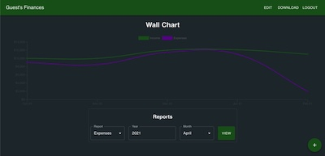

# Flask of Finances
[](https://lbesson.mit-license.org/)




## Description
Flask of Finances is a finances tracking app inspired by "Your Money or your Life." I found after years of trying to get a clear picture of my budget that the fancy apps that connected to all of my bank accounts and credit cards weren't working for me. The automagicness of it all meant that I just forgot to check up on it. I needed something a bit more hands on so that I'd be connecting with it on a more regular basis. I also wanted more control over the categories of my spending so that I could get a really granular understanding of my finances. Enter Flask of Finances, a fully customizable expense and income tracking progressive web app built with React and Flask.

## Table of Contents
* [Usage](#Usage)
* [Stack](#Stack)
* [Installation](#Installation)
* [License](#License)
* [Future-Development](#Future-Development)

## Usage
To use this app, navigate to https://flask-of-finances.herokuapp.com. There you can sign up for an account and then login to get started.
Do some initial setup by clicking on the EDIT button. Here you can add "Persons" which will be used for both income and expense logging, as well as "Broad Categories" and "Narrow Categories" for expense logging. When adding a Broad Category you have the option to decide whether that Broad Category will have a "Person" category by checking or un-checking the "Person" box. This can be useful for a category like work expenses where you may want to differentiate by person.
Once you have some expenses and income logged you'll see the chart begin to populate. This chart is inspired by the idea in "Your Money or You Life" of having a "WallChart." This is meant to be a prominent chart where you can at a glance see your monthly income and expenses plotted together. It's a great high-level depiction of your overall financial health.
Expenses and Income can be logged by clicking on the "+" icon at the bottom right and selecting the appropriate form. This functionality is available offline, so you can log expenses and income no matter where you are. They'll be uploaded to the server the next time you open the app with an internet connection.
In order to take full advantage of the offline capability of this progressive web app, download it to your iOS or Android device by navigating to the link above and then clicking "Add to Home Screen." On iOS this can be found by clicking the share icon.

If you just want to take a quick peak you are also welcome to login using the guest credentials: username: "Guest", password: "password"

## Stack
Flask of Finances is built with MySQL, Flask, React, and Typescript. The Flask server uses Pandas for generating reports and SQLAlchemy for handling the database connection, as well as PyJWT and PyBcrpyt for handling json web tokens and hashing passwords. On the front end, styling is done through Material-UI, the chart is rendered using ChartJS and the React-ChartJS-2 wrapper. Offline data storage is implemented with idb, a lightweight library that provides access to types and promises for IndexedDB. 
Flask of Finances is hosted on Heroku with the database hosted on JawsDB.

## Installation
If you'd like to run your own instance of this project follow the instructions below.
To install necessary dependencies, run the following commands:
```
npm i
pip install
``` 
To run locally then run:
```
flask run
```
and navigate to localhost:5000

Additionally, I recommend running `pip install` and `flask run` in a virtual environment using either venv or pipenv.

## License
[](https://lbesson.mit-license.org/) 

This application is covered by the [MIT license](https://lbesson.mit-license.org/).

## Future-Development
Stay tuned for these future updates!
* Generate year end expense and income reports in csv or xlsx format for tax purposes
* Generate expense and income pie charts to better visualize your finances
* Create recurring expenses / income
* Prompt for download on compatible devices 
